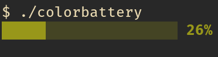

# BeautifulCopy
A command line interface program for displaying battery charge level in real time.
#### 📥Download
```bash
git clone https://github.com/massabsorb/ColorBattery.git
```

#### 🔨Build
```bash
cd ColorBattery
```
```bash
make
```

> For better experience:
```bash
sudo mv colorbattery /usr/bin/
```

#### 🧑‍💻Usage
You can copy one file per one usage:
```bash
colorbattery
```
### 🚀Executing


